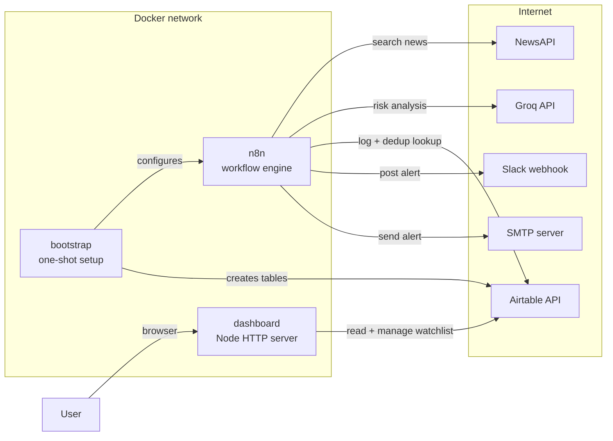
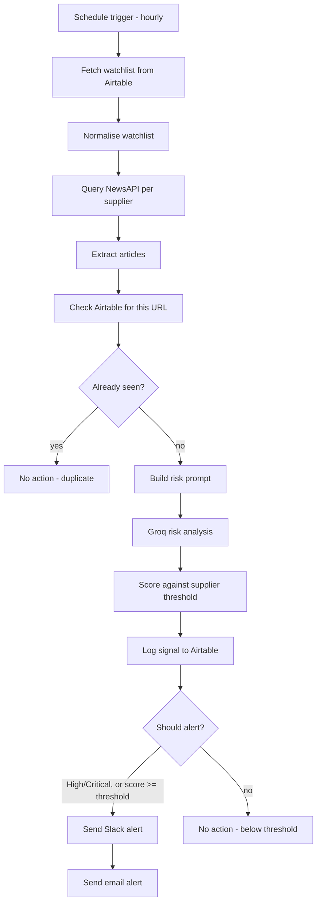
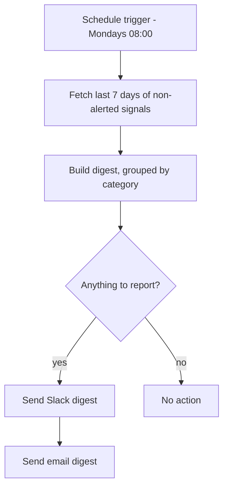

# Supply Chain Monitor

**A self-hosted early-warning system that reads the news for your suppliers so procurement doesn't have to.**

Supply Chain Monitor watches a configurable list of key suppliers and the regions they operate in, hourly. Every hour it pulls fresh news for each one, has an LLM read every article and assess supply-chain disruption risk, and the moment something crosses that supplier's own risk threshold — a strike, a factory fire, a port closure, a trade restriction — it pushes an alert to Slack and email simultaneously. Every signal it scores is logged to Airtable, so there's a permanent audit trail and a weekly digest of the quieter findings. A built-in dashboard shows what's been found and lets you manage the watchlist without ever opening n8n.

<p align="left">
  
  
  
  
  
  
</p>

---

## Table of contents

- [Why](#why)
- [Features](#features)
- [Architecture](#architecture)
  - [System overview](#system-overview)
  - [Disruption alert pipeline](#disruption-alert-pipeline)
  - [Weekly digest](#weekly-digest)
  - [Data model](#data-model)
- [Tech stack](#tech-stack)
- [Project structure](#project-structure)
- [Before you start](#before-you-start)
  - [What you need installed](#what-you-need-installed)
  - [Accounts you'll need](#accounts-youll-need)
- [Installation](#installation)
  - [Step 1 — Open a terminal in the right folder](#step-1--open-a-terminal-in-the-right-folder)
  - [Step 2 — Run the launcher](#step-2--run-the-launcher)
  - [Step 3 — Fill in the setup page](#step-3--fill-in-the-setup-page)
  - [Step 4 — Let first-boot setup finish](#step-4--let-first-boot-setup-finish)
  - [Installing without the launcher](#installing-without-the-launcher)
- [Using the application](#using-the-application)
  - [The dashboard](#the-dashboard)
  - [Managing your watchlist](#managing-your-watchlist)
  - [Writing a good search query](#writing-a-good-search-query)
  - [Tuning risk thresholds](#tuning-risk-thresholds)
  - [Reading an alert](#reading-an-alert)
  - [Testing it without waiting an hour](#testing-it-without-waiting-an-hour)
  - [Everyday commands](#everyday-commands)
- [Common errors](#common-errors)
- [Design decisions](#design-decisions)
- [Roadmap](#roadmap)
- [Contributing](#contributing)
- [Security notes](#security-notes)
- [Acknowledgments](#acknowledgments)

---

## Why

Procurement teams routinely learn about a supplier disruption only after it has already turned into a late shipment or an expediting bill. A strike, a flood, a port closure, or a factory fire is usually reported publicly hours to days before it materializes into your own supply chain, but nobody is paid to sit and read the news for every supplier, every day. Supply Chain Monitor automates exactly that reading job — fetch, analyze, score, alert, log — so a genuine early warning reaches procurement in minutes, not after the fact.

## Features

- **Automated hourly monitoring** — no manual triggering, no dashboard to remember to check.
- **LLM-graded risk analysis** — every article is read by an LLM (Groq) and scored 0–100 with a category (Low/Medium/High/Critical) and a one-sentence rationale, not just keyword matching.
- **Per-supplier risk thresholds** — a single-source critical component can alert at 60 while a commodity supplier stays at 80. High and Critical findings always alert regardless of threshold.
- **Deduplication** — an ongoing disruption that stays in the news for days is alerted once, not every hour. Already-seen articles are skipped before the LLM is called, so they cost nothing.
- **Multi-channel alerting** — findings that cross the threshold go to Slack and email at the same time.
- **A permanent audit trail** — *every* scored signal is logged to Airtable, not just the alerting ones, so quiet findings remain reviewable.
- **Weekly digest** — a Monday rollup of everything that was scored but stayed below the alert threshold, for visibility without alert fatigue.
- **Built-in dashboard** — KPIs, recent signals, and full watchlist management (add/remove suppliers, tune thresholds, pause monitoring) in a browser, with the Airtable token kept server-side.
- **Guided first-run setup** — a launcher script opens a setup page that walks you through every account you need, with a live **Test** button beside each key that checks it against the real service before saving. No hand-editing config files, no guessing whether a key works.
- **Unattended first boot** — a bootstrap container then provisions the Airtable tables, creates the n8n account and SMTP credential, and imports and activates both workflows. No manual clicking through n8n.
- **No proprietary data leaves your systems** — only public article text and the supplier/region names from your watchlist are sent to NewsAPI and Groq.

## Architecture

### System overview



Three services: `n8n` runs the pipelines, `dashboard` serves the UI and proxies Airtable, and `bootstrap` is a one-shot container that configures everything on first boot and then exits.

### Disruption alert pipeline

Runs hourly. Reads the watchlist from Airtable, checks each supplier for fresh news, skips anything already seen, scores the rest, and alerts on what crosses that supplier's threshold:



The duplicate check sits *before* the LLM call deliberately — a disruption that stays in the news for a week costs one analysis, not a hundred and sixty-eight.

### Weekly digest



### Data model

Airtable holds two tables, both created automatically by the bootstrap container.

**`Disruption Alerts`** — every scored signal, one row each:

| Field | Type | Purpose |
|---|---|---|
| `Article Title` | Single line text | The news article's headline (primary field) |
| `Detected At` | Date/time | When the pipeline scored it |
| `Supplier` / `Region` | Single line text | Which watchlist entry matched |
| `Article URL` | URL | Source link — also the deduplication key |
| `Source` | Single line text | Publisher name, from NewsAPI |
| `Published At` | Date/time | The article's original publish time |
| `Risk Score` | Number | 0–100, from Groq |
| `Risk Category` | Single select | Low / Medium / High / Critical |
| `Risk Reasoning` | Long text | One-sentence rationale from Groq |
| `Risk Threshold Used` | Number | The supplier's threshold at scoring time |
| `Alert Sent` | Checkbox | Whether it escalated to Slack + email |
| `Alert Channels` | Multiple select | Slack / Email |

**`Watchlist`** — what gets monitored, editable from the dashboard or Airtable directly:

| Field | Type | Purpose |
|---|---|---|
| `Supplier` | Single line text | Supplier name (primary field) |
| `Region` | Single line text | Where they operate |
| `Search Query` | Long text | The NewsAPI boolean query for this supplier |
| `Risk Threshold` | Number | Score at which this supplier escalates (default 70) |
| `Active` | Checkbox | Uncheck to pause monitoring without deleting |

## Tech stack

| Layer | Technology |
|---|---|
| Orchestration | [n8n](https://n8n.io) |
| News source | [NewsAPI](https://newsapi.org) (free "Developer" tier) |
| Risk analysis (LLM) | [Groq](https://groq.com) (`llama-3.3-70b-versatile`) |
| Data store / audit log | [Airtable](https://airtable.com) |
| Alerting | Slack Incoming Webhook + SMTP email |
| Dashboard | Node.js standard library (no framework, no build step) |
| Runtime | Docker Compose |

## Project structure

```text
Supply-Chain-Monitor-System/
├── README.md                 # this file
├── requirements.txt          # host-level prerequisites (nothing to pip install)
├── .gitignore                # keeps .env (real API keys) out of git entirely
└── Supply-Chain-Monitor/   # everything runtime lives here
    ├── start.ps1             # one-command launcher (Windows)
    ├── start.sh              # one-command launcher (macOS / Linux)
    ├── docker-compose.yml    # n8n + dashboard + one-shot bootstrap
    ├── .env.example          # environment variable template
    ├── .env                  # your real keys — created on first run, never committed
    ├── bootstrap/
    │   └── bootstrap.js      # first-boot setup: Airtable tables, n8n account, credential, workflows
    ├── dashboard/
    │   ├── server.js         # HTTP server, Airtable proxy, first-run setup API
    │   └── public/
    │       ├── index.html    # the dashboard
    │       ├── setup.html    # the guided first-run setup page
    │       ├── styles.css
    │       ├── app.js        # dashboard behaviour
    │       └── setup.js      # setup form + live "test this key" checks
    └── workflows/
        ├── supply-chain-disruption-alert.json   # the hourly pipeline
        └── weekly-digest.json                   # the Monday rollup
```

## Before you start

### What you need installed

| Requirement | Notes |
|---|---|
| **Docker Desktop** (Windows/macOS) or **Docker Engine + Compose v2** (Linux) | The only mandatory install. Verify with `docker compose version`. |
| ~1 GB free disk | For the `n8n` and `node:22-alpine` images. No local AI model is downloaded. |
| A web browser | For the setup page and dashboard. |

There is nothing to `pip install` and nothing to `npm install` — every component runs inside a container. See [`requirements.txt`](requirements.txt) for the full list.

### Accounts you'll need

All free tier. You do **not** need to prepare these in advance — the setup page links each one and tests it for you — but here's what's coming:

| Service | What you're getting | Where |
|---|---|---|
| **NewsAPI** | An API key | [newsapi.org/register](https://newsapi.org/register) |
| **Groq** | An API key | [console.groq.com/keys](https://console.groq.com/keys) |
| **Airtable** | An empty base **and** a personal access token | [airtable.com](https://airtable.com) + [airtable.com/create/tokens](https://airtable.com/create/tokens) |
| **Slack** | An incoming webhook URL | [api.slack.com/messaging/webhooks](https://api.slack.com/messaging/webhooks) |
| **Email (SMTP)** | Host, port, username, password | Gmail: `smtp.gmail.com:587` + an [app password](https://support.google.com/accounts/answer/185833). Optional. |

Two details worth knowing before you get there, because they're the two things people get wrong:

- **The Airtable base must be empty.** Create it and leave it alone — the tables inside it are built for you. Its ID is the `appXXXXXXXXXXXXXX` portion of the URL while the base is open.
- **The Airtable token needs four scopes**, all on that base: `data.records:read`, `data.records:write`, `schema.bases:read`, `schema.bases:write`. The two schema scopes are what allow the tables to be created, and they're the ones most often missed. You must also explicitly add the base under the token's **Access** section.

## Installation

### Step 1 — Open a terminal in the right folder

Everything runs from the inner `Supply-Chain-Monitor` folder, not the outer one.

```bash
cd Supply-Chain-Monitor
```

Make sure Docker Desktop is actually running first — the whale icon in your system tray/menu bar should be steady, not animating.

### Step 2 — Run the launcher

The launcher is a shell script. Which one you run, and how, depends on your operating system.

#### Windows (PowerShell)

Open **PowerShell** (not Command Prompt), `cd` into the folder, then:

```powershell
.\start.ps1
```

Note the leading `.\` — PowerShell will not run a script from the current folder without it.

**If you get a red error about scripts being disabled on this system**, that's Windows' default execution policy blocking unsigned scripts. It's expected, not a problem with the project. Either run it in a way that bypasses the policy just for this one command:

```powershell
powershell -ExecutionPolicy Bypass -File .\start.ps1
```

…or allow scripts for the current terminal session only (reverts when you close the window):

```powershell
Set-ExecutionPolicy -Scope Process -ExecutionPolicy Bypass
.\start.ps1
```

If you copied the project from another machine or downloaded it, Windows may also mark the file as blocked. Clear that with:

```powershell
Unblock-File .\start.ps1
```

#### macOS / Linux

```bash
chmod +x start.sh    # only needed the first time
./start.sh
```

`chmod +x` marks the file executable. If you'd rather skip that step, `bash start.sh` works too and does the same thing.

#### Windows with Git Bash

If you prefer Git Bash over PowerShell, the `.sh` script works there as well:

```bash
bash start.sh
```

#### What the launcher does

1. Checks Docker is running (and tells you clearly if it isn't).
2. Starts the dashboard container.
3. Opens `http://localhost:8080/setup` in your browser.
4. **Waits** while you fill in the form — leave the terminal open.
5. The moment you save, it brings up the rest of the stack, runs first-boot setup, prints the logs, and opens the dashboard.

### Step 3 — Fill in the setup page

The page walks through six steps, each linking exactly where to click:

| # | What it asks for | Notes |
|---|---|---|
| 1 | An email and password for n8n | You invent these now. The account is created for you. Password needs 8+ characters, one uppercase, one number. |
| 2 | NewsAPI key | Free tier only works from `localhost`, which is where this runs. |
| 3 | Groq key | Shown only once when you create it — copy it immediately. |
| 4 | Airtable token + base ID | See the two warnings in [Accounts you'll need](#accounts-youll-need). |
| 5 | Slack webhook URL | Testing this posts a real message to your chosen channel. |
| 6 | Alert recipient + SMTP details | SMTP is optional — leave blank to run Slack-only. |

Use the **Test** button beside each key before saving. It calls the real service and tells you precisely what's wrong — a rejected key, missing Airtable scopes, an exhausted quota — which is far faster than discovering it later in a failed workflow run.

You never have to invent an `N8N_ENCRYPTION_KEY`; a random one is generated for you.

When you press **Save configuration**, your answers are written to a local `.env` file. Nothing is uploaded anywhere.

### Step 4 — Let first-boot setup finish

The launcher continues automatically. You'll see:

```text
[bootstrap] n8n is up and its REST API is serving.
[bootstrap] Created n8n owner account for you@example.com.
[bootstrap] Created Airtable table "Disruption Alerts".
[bootstrap] Created Airtable table "Watchlist".
[bootstrap] Seeded the watchlist with 3 example suppliers — replace these with your real ones.
[bootstrap] Created SMTP credential "Supply Chain Monitor SMTP".
[bootstrap] Imported "Supply Chain Monitor - Supply Chain Disruption Alert".
[bootstrap] Activated "Supply Chain Monitor - Supply Chain Disruption Alert".
[bootstrap] Imported "Supply Chain Monitor - Weekly Signal Digest".
[bootstrap] Activated "Supply Chain Monitor - Weekly Signal Digest".
[bootstrap] Setup complete.
```

Then you're live:

- **Dashboard** — <http://localhost:8080>
- **n8n** — <http://localhost:5678> (log in with the email/password from step 3)

Warnings rather than errors here are normal if you skipped SMTP — Slack alerts still work. Anything that failed is named explicitly, so you know what to fix.

### Installing without the launcher

If you'd rather not use a shell script at all:

```bash
cd Supply-Chain-Monitor
cp .env.example .env      # Windows: copy .env.example .env
```

Open `.env` in a text editor and fill in every value — it documents each one inline. Generate an encryption key with:

```bash
python -c "import secrets; print(secrets.token_hex(32))"
```

Then start everything:

```bash
docker compose up -d
docker compose logs -f bootstrap
```

The result is identical; you've just done by hand what the setup page does for you.

## Using the application

### The dashboard

<http://localhost:8080> is where you'll spend your time. It refreshes itself every minute.

- **Overview** — signals analysed, how many escalated to alerts, the average risk score, and how many suppliers are actively monitored.
- **Risk breakdown** — how recent findings distribute across Low / Medium / High / Critical.
- **Recent signals** — every scored article, newest first, with a link to the source. A tick in the **Alerted** column means it went to Slack and email.
- **Watchlist** — add, edit, pause, or remove suppliers.

### Managing your watchlist

Bootstrap seeds three fictional suppliers (`Acme Components`, `Meridian Textiles`, `Northbay Electronics`) so nothing is empty on first run. **Replace them with your real suppliers.**

- **Add** — fill the form at the bottom of the Watchlist panel: supplier, region, a search query, and a risk threshold.
- **Pause** — untick **Active**. The supplier stays configured but is skipped each hour. Better than deleting if you only want to mute it temporarily.
- **Change a threshold** — type a new number directly in the table; it saves as soon as you click away.
- **Remove** — the **Remove** button deletes the watchlist row. Previously logged signals for that supplier are kept.

Everything here writes straight to Airtable, so you can equally edit it in Airtable directly if you prefer — the pipeline reads whatever is there at the top of each hour.

### Writing a good search query

The query goes to NewsAPI, which supports quotes for exact phrases and `AND` / `OR` / `NOT`. Pair the supplier's name with the disruption vocabulary that actually applies to them:

```text
"Acme Components" AND (strike OR shortage OR delay OR disruption OR port OR earthquake)
```

- Quote multi-word supplier names, or you'll match any article containing either word.
- Too few results? Loosen the second half, or check the supplier is actually named that way in the press — a parent company or brand name often gets the coverage.
- Too much noise? Add `NOT` terms, e.g. `NOT (earnings OR dividend)`.

### Tuning risk thresholds

Each supplier has its own threshold — the score at or above which a finding escalates to Slack and email.

- **Lower it (e.g. 55)** for sole-source or long-lead-time suppliers where you want early warning even on ambiguous signals.
- **Raise it (e.g. 85)** for commodity suppliers you could replace quickly, to cut noise.
- **High and Critical categories always alert**, regardless of the number. The threshold only decides how far down the scale you want to be interrupted.

If real disruptions are being logged but not alerting, check the **Risk Score** and **Risk Threshold Used** columns of recent rows and adjust from there.

### Reading an alert

Slack and email both get the same content:

```text
🚨 Supply chain risk alert (Critical, score 92)
Supplier: Acme Components  Region: Taiwan
Article: Strike halts production at Acme Components plant in Taiwan
https://news.example/acme-strike
Why: Active strike halting production with no resolution timeline.
```

The **Why** line is the model's own one-sentence justification — it's there so you can judge in a second whether the alert deserves action, without opening the article.

Every Monday at 08:00, a digest of the week's *below-threshold* findings goes out on both channels, so quiet signals still get seen without interrupting anyone mid-week.

### Testing it without waiting an hour

The pipeline runs at the top of every hour. To trigger it immediately:

1. Open <http://localhost:5678> and log in.
2. Open **Supply Chain Monitor - Supply Chain Disruption Alert**.
3. Click **Execute workflow**.

Then refresh the dashboard — the Recent signals table should populate. You can also check via the API:

```bash
curl -s http://localhost:8080/api/health
curl -s http://localhost:8080/api/stats
curl -s "http://localhost:8080/api/alerts?limit=5"
```

### Everyday commands

Run these from the `Supply-Chain-Monitor` folder:

| Task | Command |
|---|---|
| Start everything | `docker compose up -d` (or run the launcher again) |
| Stop everything | `docker compose down` |
| See what's running | `docker compose ps` |
| Watch the setup log | `docker compose logs -f bootstrap` |
| Watch n8n's log | `docker compose logs -f n8n` |
| Re-run first-boot setup | `docker compose up -d bootstrap --force-recreate` |
| Apply a change to `dashboard/server.js` | `docker compose restart dashboard` |
| Full reset of n8n's local state | `docker compose down -v` then `docker compose up -d` |

`docker compose down` is safe — your Airtable data lives in Airtable, not in the container. `down -v` additionally wipes n8n's local volume (account, credentials, execution history); bootstrap recreates all of it on the next start.

Note the difference between the dashboard's two kinds of files: anything under `dashboard/public/` (the HTML/CSS/JS the browser loads) is re-read from disk on every request, so editing those takes effect immediately — just refresh the page. `dashboard/server.js` itself is the running Node process; it's only loaded once at container start, so a change there needs the restart above to take effect. If you ever edit that file and the dashboard doesn't reflect it, this is why.

## Common errors

<details>
<summary><strong>"start.ps1 cannot be loaded because running scripts is disabled on this system"</strong></summary>

<br>

Windows blocks unsigned PowerShell scripts by default. Nothing is wrong with the project. Run it bypassing the policy for this one command:

```powershell
powershell -ExecutionPolicy Bypass -File .\start.ps1
```

Or allow scripts for just this terminal session:

```powershell
Set-ExecutionPolicy -Scope Process -ExecutionPolicy Bypass
.\start.ps1
```

If it still refuses, the file may be marked as downloaded-from-the-internet: `Unblock-File .\start.ps1`.
</details>

<details>
<summary><strong>"start.ps1 is not recognized as the name of a cmdlet"</strong></summary>

<br>

You typed `start.ps1` without the leading `.\`. PowerShell does not run scripts from the current directory unless you say so explicitly:

```powershell
.\start.ps1
```

Also confirm you're in the `Supply-Chain-Monitor` folder (`ls` should show `docker-compose.yml`).
</details>

<details>
<summary><strong>"permission denied: ./start.sh" on macOS or Linux</strong></summary>

<br>

The file isn't marked executable yet:

```bash
chmod +x start.sh
./start.sh
```

Or skip the flag entirely with `bash start.sh`.
</details>

<details>
<summary><strong>"Could not reach the Docker engine" — but Docker Desktop is open</strong></summary>

<br>

Docker Desktop being *open* is not the same as its engine being *running*. The most common cause is **Resource Saver mode**, which suspends the engine when it has been idle — you'll see it noted at the bottom of the Docker Desktop window. The launcher now waits up to 90 seconds for the engine to wake, so simply running it again usually works.

A confusing detail worth knowing: `docker compose version` succeeds even when the engine is completely down, because it's a client-side command that never contacts the daemon. Use this instead — it fails if the engine isn't up:

```bash
docker info
```

To wake it deliberately, click into the Docker Desktop window, or run any real command (`docker ps`) and give it a few seconds. On Linux, you may need `sudo systemctl start docker`, or to add yourself to the `docker` group.
</details>

<details>
<summary><strong>"port is already allocated" / "bind: address already in use"</strong></summary>

<br>

Something else on your machine is using port 8080 or 5678. Either stop that program, or change the dashboard's port in `.env`:

```text
DASHBOARD_PORT=8090
```

then `docker compose up -d`. To find the culprit: `netstat -ano | findstr :8080` on Windows, `lsof -i :8080` on macOS/Linux.
</details>

<details>
<summary><strong>Bootstrap says it can't create the Airtable tables (HTTP 401 / 403 / 404)</strong></summary>

<br>

Almost always the token, and almost always scopes. Check all four, at [airtable.com/create/tokens](https://airtable.com/create/tokens):

- `data.records:read`, `data.records:write`, `schema.bases:read`, `schema.bases:write`
- and the base itself added under the token's **Access** section — a token with perfect scopes but no base attached still returns 403/404.

A **404** usually means the base ID is wrong; it should look like `appXXXXXXXXXXXXXX`, taken from the URL while the base is open. After fixing, re-run:

```bash
docker compose up -d bootstrap --force-recreate
```

</details>

<details>
<summary><strong>The setup page says "Setup has already been completed"</strong></summary>

<br>

By design — it's first-run only, so nobody can re-point a running system at a different Airtable base. To change configuration, edit `.env` directly and restart with `docker compose up -d`.

If you genuinely want to start over: delete `.env`, run `docker compose down -v`, then run the launcher again.
</details>

<details>
<summary><strong>The dashboard loads but says "Airtable isn't configured yet"</strong></summary>

<br>

The containers were started before `.env` had real values, so they're still holding the old (empty) environment. Recreate them so they pick it up:

```bash
docker compose up -d
```

If it persists, confirm `AIRTABLE_API_KEY` and `AIRTABLE_BASE_ID` in `.env` are real values and not still `replace-with-...`.
</details>

<details>
<summary><strong>No signals are appearing at all</strong></summary>

<br>

Work through these in order:

1. Is the watchlist non-empty, with **Active** ticked?
2. Has the workflow actually run? The schedule fires at the top of the hour — trigger it manually in n8n to check now.
3. Is `NEWSAPI_KEY` valid and within the free tier's 100 requests/day? Each active supplier costs one request per hour, so ~4 suppliers will exhaust the daily quota. Reduce suppliers or pause some.
4. Does the search query match how the supplier is actually named in the press? Try loosening it.
5. In n8n, open the last execution and inspect the **Extract Articles** node's output to see whether NewsAPI returned anything at all.

</details>

<details>
<summary><strong>Signals are logged but no alerts fire</strong></summary>

<br>

That's the threshold working as intended. Check the **Risk Score** and **Risk Threshold Used** columns on recent rows. If genuine disruptions are scoring below their threshold, lower that supplier's threshold on the dashboard. High and Critical always alert regardless of score.
</details>

<details>
<summary><strong>Slack alerts work but email doesn't</strong></summary>

<br>

Usually the SMTP credential. If you left the SMTP fields blank during setup, bootstrap skipped creating it by design and the email node has nothing attached — fill them into `.env` and run `docker compose up -d bootstrap --force-recreate`.

With Gmail, an ordinary account password will **not** work; it must be an [app password](https://support.google.com/accounts/answer/185833), which requires 2-factor authentication to be enabled first. Also confirm the **Send Email Alert** node's `fromEmail` is an address your SMTP account is allowed to send as.
</details>

<details>
<summary><strong>Groq returns a "model not found" or decommissioned error</strong></summary>

<br>

Providers retire models periodically. The workflows use `llama-3.3-70b-versatile`. Check the current list at [console.groq.com/docs/models](https://console.groq.com/docs/models), then update the model name in the **Build Risk Prompt** node inside n8n (or in `workflows/supply-chain-disruption-alert.json` before importing).
</details>

<details>
<summary><strong>NewsAPI returns 426 or 429</strong></summary>

<br>

**429** is the free tier's rate limit — 100 requests/day. Pause some suppliers or reduce how many are active.

**426** means the request was rejected as upgrade-required, which on the free plan usually means it was made from something other than `localhost`. This project runs locally by design; deploying it to a server needs a paid NewsAPI plan.
</details>

<details>
<summary><strong>"docker compose up fails with an encryption key mismatch"</strong></summary>

<br>

`.env`'s `N8N_ENCRYPTION_KEY` no longer matches what a previous run stored in the `n8n_data` volume — usually because `.env` was regenerated. Either restore the original key, or reset n8n's local state:

```bash
docker compose down -v
docker compose up -d
```

`down -v` deletes n8n's account, credentials and execution history. Your Airtable data is untouched.
</details>

<details>
<summary><strong>The same disruption alerted twice</strong></summary>

<br>

Deduplication keys on the exact article URL, so the *same* article can only alert once. Two different outlets covering the same event are two different URLs and will both alert. Fuzzy cross-outlet deduplication is on the roadmap.
</details>

## Design decisions

A few choices worth explaining, since they weren't the only option:

- **The dashboard has no framework and no build step.** It's Node's standard library plus plain HTML/CSS/JS. That means no `npm install`, no lockfile drift, no build stage in the image — the stack starts identically on any machine with Docker, which matters more here than the ergonomics a framework would buy for a UI this size.
- **The Airtable token never reaches the browser.** The dashboard talks to its own backend, which proxies Airtable. A static page calling Airtable directly would have been simpler but would expose a write-capable token in client-side JavaScript.
- **Deduplication happens before the LLM call, not after.** Skipping a known article costs one cheap Airtable lookup; scoring it costs a Groq call. For a story that stays in the news for a week, that's the difference between one analysis and dozens.
- **Every signal is logged, but only threshold-crossers alert.** The audit trail is what makes the weekly digest and any accuracy review possible; alerting on everything would defeat the purpose.
- **Bootstrap is idempotent by design.** It checks for existing state at each step rather than assuming a fresh install, so it's safe on every `docker compose up`, not just the first.
- **The setup page writes `.env` rather than configuring n8n live.** Setting secrets into a running n8n without a restart would mean either n8n's Variables feature (licensed — unavailable in Community Edition) or fetching config at runtime, which would put the Slack webhook URL in n8n's plaintext execution history. Writing `.env` and letting the launcher restart the stack keeps every secret in environment variables and n8n's encrypted credential store, at the cost of one command the user was already running.
- **The launcher restarts Docker, not the container.** Giving the dashboard container control of Docker would mean mounting the Docker socket, which grants it root-equivalent control of the host. A host-side script does the same job with the user's own permissions and no privilege escalation.
- **Setup is first-run only, and ports bind to `127.0.0.1`.** Once `.env` exists the setup endpoint refuses further writes, so nobody can re-point the pipeline at their own Airtable base. Both services are unreachable from other machines by construction rather than by an application-level login.

## Roadmap

- Pagination past 100 records in the weekly digest and dashboard queries
- Fuzzy deduplication (same disruption reported by several outlets under different URLs)
- Alert lead-time measurement, to evidence the 24–72 hour KPI against real incidents
- Per-supplier alert routing, so different categories reach different channels or people

## Contributing

Issues and pull requests are welcome. The workflows are plain n8n JSON exports — edit them visually in the n8n UI and re-export, or edit the JSON directly for small, targeted changes.

## Security notes

- `.env` holds real, live API keys tied to your own accounts and is **gitignored** — it must never be committed, even temporarily.
- The Airtable token stays server-side; the browser only ever talks to the dashboard's own API.
- The SMTP credential lives in n8n's encrypted credential store, created at bootstrap time and never written into the workflow JSON.
- Both the dashboard and n8n bind to `127.0.0.1` only, so neither is reachable from other machines on your network.
- The setup page accepts configuration once and then refuses further writes.
- Only public article text, titles, and your watchlist's supplier/region names are sent to NewsAPI and Groq — no internal supplier, contract, pricing, or shipment data.

## Acknowledgments

Built on top of [n8n](https://n8n.io), [NewsAPI](https://newsapi.org), [Groq](https://groq.com), [Airtable](https://airtable.com), and [Slack](https://slack.com).
